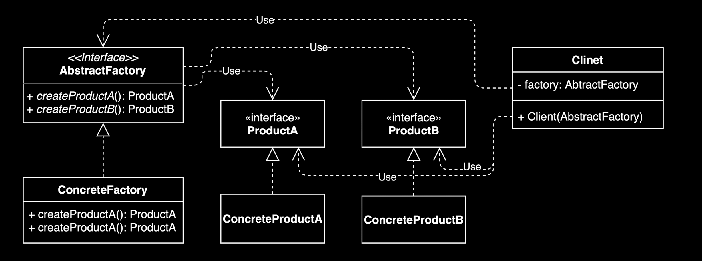

# 추상 팩토리 패턴

* 구체적으로 어떤 클래스의 인스턴스를 사용하는지 감출 수 있다.

## 추상 팩토리 패턴 vs. 팩토리 메소드 패턴

| 항목 | 팩토리 메소드 패턴 | 추상 팩토리 패턴 |
|------|------------------|-----------------|
| 공통점 | 둘 다 구체적인 객체 생성 과정을 추상화한 인터페이스를 제공 | |
| 초점 | 팩토리를 구현하는 방법 (inheritance) | 팩토리를 사용하는 방법 (composition) |
| 목적 | 구체적인 객체 생성 과정을 하위 또는 구체적인 클래스로 옮기는 것 | 관련있는 여러 객체를 구체적인 클래스에 의존하지 않고 만들 수 있게 해주는 것 |

## 실무 예시

### 1. GUI 툴킷 라이브러리 
다양한 운영체제에서 동작하는 GUI 애플리케이션 개발 시, 각 플랫폼에 맞는 **관련된 UI 컴포넌트들의 집합**을 함께 생성해야 한다.

**핵심**: 하나의 팩토리가 Button, Checkbox, Scrollbar 등 여러 관련된 컴포넌트를 함께 생성한다.

**예시:**
- `WindowsFactory` → Windows 스타일의 Button + Checkbox + Scrollbar + ... (집합 생성)
- `MacOSFactory` → macOS 스타일의 Button + Checkbox + Scrollbar + ... (집합 생성)
- `LinuxFactory` → Linux 스타일의 Button + Checkbox + Scrollbar + ... (집합 생성)

### 2. 데이터베이스 연결 라이브러리 
여러 종류의 데이터베이스를 지원할 경우, 각 데이터베이스에 맞는 **관련된 연결 객체들의 집합**을 생성한다.

**핵심**: 하나의 팩토리가 Connection, Statement, ResultSet 등 관련된 객체들을 함께 생성한다.

**예시:**
- `MySQLFactory` → MySQL Connection + Statement + ResultSet 생성 (집합)
- `PostgreSQLFactory` → PostgreSQL Connection + Statement + ResultSet 생성 (집합)
- `OracleFactory` → Oracle Connection + Statement + ResultSet 생성 (집합)

### 3. 테마 기반 UI 컴포넌트 생성 
애플리케이션의 테마(다크 모드, 라이트 모드)에 따라 일관된 스타일의 UI 컴포넌트들을 함께 생성한다.

**핵심**: 하나의 팩토리가 같은 테마의 여러 UI 컴포넌트를 함께 생성한다.

**예시:**
- `DarkThemeFactory` → 다크 테마의 Button + Dialog + Menu + ... 생성 (집합)
- `LightThemeFactory` → 라이트 테마의 Button + Dialog + Menu + ... 생성 (집합)

