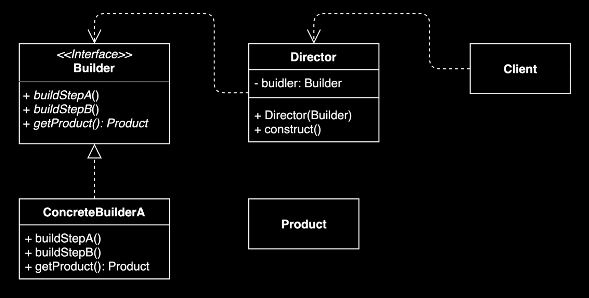

# 빌더 (Builder) 패턴

## 개요
빌더 패턴은 동일한 프로세스를 거쳐 다양한 구성의 인스턴스를 만드는 생성 디자인 패턴입니다. 복잡한 객체의 생성 과정을 단계별로 분리하여 가독성과 유지보수성을 향상시킵니다.

## 장점
* **단계별 객체 생성**: 만들기 복잡한 객체를 순차적으로 만들 수 있음
* **구현 세부사항 캡슐화**: 복잡한 객체를 만드는 구체적인 과정을 숨길 수 있음
* **유연한 객체 구성**: 동일한 프로세스를 통해 각기 다른 구성의 객체를 만들 수 있음
* **안전한 객체 생성**: 불완전한 객체를 사용하지 못하도록 방지할 수 있음

## 단점
* **추가 복잡도**: 원하는 객체를 만드려면 빌더부터 만들어야 함
* **구조 복잡성**: 구조가 복잡해짐