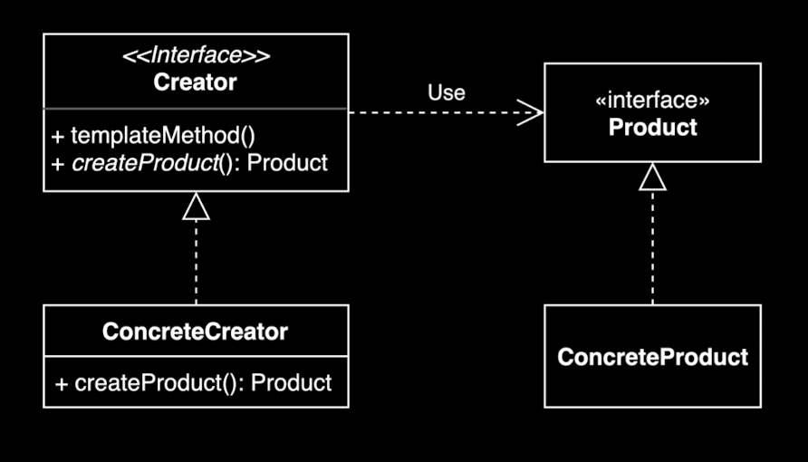

# 팩토리 메소드 패턴



## 팩토리 메소드 패턴을 적용했을 떄의 장점/단점?

**장점:**
- **느슨한 결합 (Loose Coupling)**: 클라이언트 코드가 구체적인 클래스를 직접 생성하지 않고, 인터페이스를 통해 객체를 생성하므로 결합도가 낮아짐.
- **확장성 (Extensibility)**: 새로운 제품 타입을 추가할 때 Creator 클래스는 수정할 필요 없이 새로운 ConcreteCreator만 추가하면 가능. (개방-폐쇄 원칙(OCP))
- **단일 책임 원칙 (SRP)**: 객체 생성 로직을 Creator 클래스로 분리함으로써 클라이언트 코드는 사용에만 집중할 수 있음.
- **코드 재사용성**: 공통된 생성 로직을 Creator에서 정의하여 코드 중복을 줄일 수 있음.

**단점:**
- **클래스 수 증가**: 패턴을 적용하면 ConcreteCreator와 Product 클래스들이 추가되어 전체적으로 클래스 수가 늘어남.
- **복잡도 증가**: 단순한 객체 생성의 경우 패턴 적용이 오히려 과도한 추상화일 수 있음.
- **이해도 저하**: 패턴을 처음 접하는 개발자에게는 코드 흐름 파악이 어려울 수 있음.


## "확장에 열려있고 변경에 닫혀있는 객체 지향 원칙"을 설명하세요.

**개방-폐쇄 원칙 (Open-Closed Principle, OCP)**은 소프트웨어 설계의 핵심 원칙 중 하나

**핵심 개념:**
- **확장에 열려있다 (Open for Extension)**: 새로운 기능이나 요구사항이 추가될 때 기존 코드를 확장할 수 있어야 한다. 즉, 새로운 클래스를 추가하는 방식으로 기능을 확장할 수 있어야 한다.
- **변경에 닫혀있다 (Closed for Modification)**: 기존 코드는 수정하지 않아야 한다. 이미 테스트되고 검증된 코드를 건드리지 않고 확장할 수 있어야 한다.

**팩토리 메소드 패턴과의 연관성:**
팩토리 메소드 패턴은 OCP를 구현하는 대표적인 예시. 새로운 제품 타입을 추가하려면:
- 기존 Creator 클래스는 전혀 수정하지 않음 (변경에 닫혀있음)
- 새로운 ConcreteCreator 클래스만 추가하면 됨 (확장에 열려있음)

**예시:** 만약 데이터베이스 연결을 다루는 팩토리가 있다면, 새로운 데이터베이스 타입(예: PostgreSQL)을 추가할 때 기존 MySQL, Oracle 관련 코드는 그대로 두고 새로운 PostgresCreator만 추가하면 된다.

## 자바 8에 추가된 default 메소드에 대해 설명하세요.

**Default 메소드**는 Java 8에서 인터페이스에 추가된 기능으로, 인터페이스에서 구현부가 있는 메소드를 정의할 수 있게 해준다.

**주요 특징:**
- `default` 키워드로 선언하며, 메소드 본문(구현부)을 가질 수 있다.
- 인터페이스를 구현하는 모든 클래스에서 자동으로 상속받게 된다.
- 클래스에서 오버라이드(재정의)할 수도 있다.

**등장 배경:**
- Java 8에서 Stream API, 람다식 등 새로운 기능들이 추가되면서 기존 인터페이스(예: Collection)에 새로운 메소드를 추가해야 했음.
- 기존 인터페이스에 추상 메소드를 추가하면 이를 구현하는 모든 클래스에서 컴파일 에러가 발생함.
- Default 메소드를 사용하면 기존 코드를 수정하지 않고도 새로운 기능을 추가할 수 있음. (역추적 호환성 유지)

**예시:**
```java
interface Factory {
    Product createProduct();
    
    // Default 메소드
    default void logCreation(String productType) {
        System.out.println("Creating: " + productType);
    }
}
```

**팩토리 메소드 패턴과의 연관성:**
Creator 인터페이스에서 공통 로직(예: 로깅, 검증 등)을 default 메소드로 구현하고, 실제 객체 생성은 추상 메소드로 남겨두어 확장성을 유지할 수 있음.

