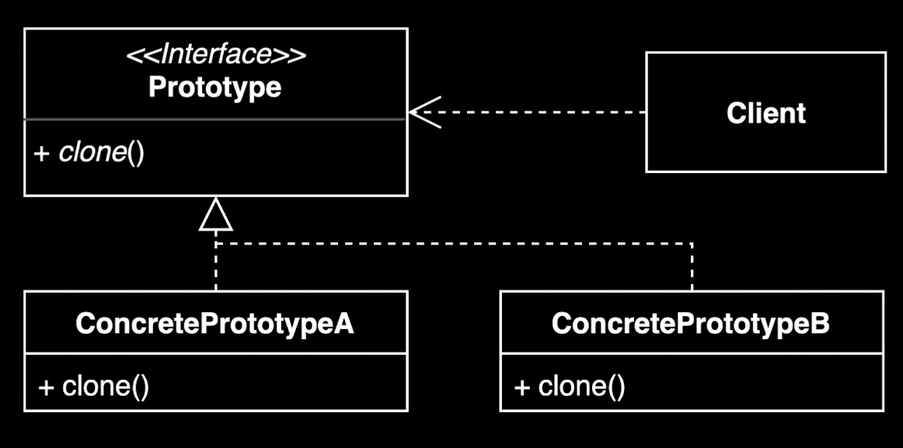

# 프로토타입 (Prototype) 패턴

## 개념
기존 인스턴스를 복제하여 새로운 인스턴스를 만드는 방법

- 복제 기능을 갖추고 있는 기존 인스턴스를 프로토타입으로 사용해 새 인스턴스를 만들 수 있음

## 장점
- 복잡한 객체를 만드는 과정을 숨길 수 있음
- 기존 객체를 복제하는 과정이 새 인스턴스를 만드는 것보다 비용(시간 또는 메모리) 측면에서 효율적일 수 있음
- 추상적인 타입을 리턴할 수 있음

## 단점
- 복제한 객체를 만드는 과정 자체가 복잡할 수 있음 (예: 순환 참조가 있는 경우)

## 실무 활용 사례
- 자바 `Object` 클래스의 `clone()` 메소드와 `Cloneable` 인터페이스
- Shallow copy와 Deep copy
- ModelMapper 라이브러리