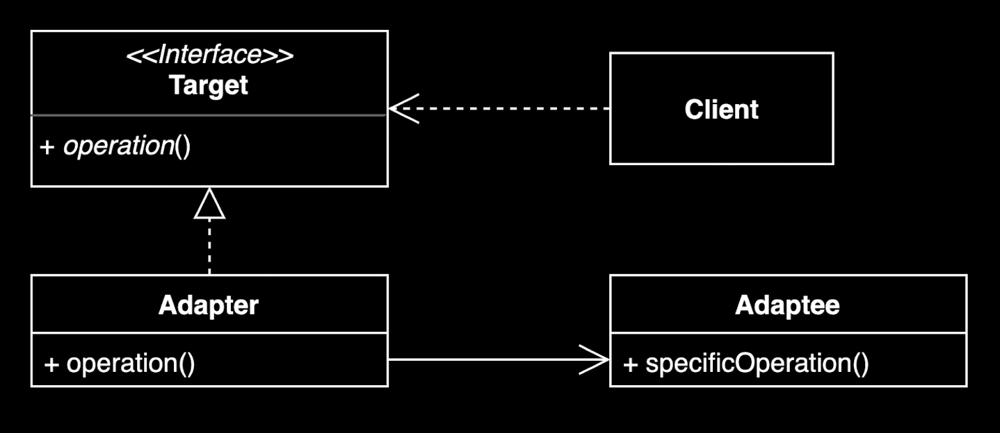

# 어댑터 (Adapter) 패턴



## 개념

기존 코드를 클라이언트가 사용하는 인터페이스의 구현체로 바꿔주는 패턴

> 서로 호환되지 않는 인터페이스를 가진 객체들이 협업할 수 있도록 해주는 구조적 디자인 패턴

## 장점

- **기존 코드 재사용**: 기존 코드를 변경하지 않고 원하는 인터페이스 구현체를 만들어 재사용할 수 있음
- **단일 책임 원칙(SRP)**: 기존 코드가 하던 일과 인터페이스 변환 작업을 각기 다른 클래스로 분리하여 관리할 수 있음
- **개방-폐쇄 원칙(OCP)**: 클라이언트 코드를 수정하지 않고 새로운 어댑터를 도입할 수 있음

## 단점

- **복잡도 증가**: 새 클래스가 생겨 복잡도가 증가할 수 있음
- 경우에 따라서는 기존 코드가 해당 인터페이스를 직접 구현하도록 수정하는 것이 더 나은 선택일 수 있음

---

## 예제: 통합 결제 시스템

### 시나리오

기존에 **카카오페이**, **네이버페이**가 통합 결제 인터페이스(`PaymentProcessor`)를 구현하여 사용 중인 상황에서,
**현대페이**가 새롭게 추가되어야 함. 하지만 현대페이는 자체적인 API를 가지고 있어 기존 인터페이스와 호환되지 않음.

### 구조

```
┌─────────────────────────────────────────────────────────────────┐
│                        Client (PaymentDemo)                     │
│                   PaymentProcessor 인터페이스만 의존                 │
└─────────────────────────────────────────────────────────────────┘
                                  │
                                  ▼
┌─────────────────────────────────────────────────────────────────┐
│                  <<interface>> PaymentProcessor                 │
│  ─────────────────────────────────────────────────────────────  │
│  + processPayment(amount: int): boolean                         │
│  + cancelPayment(transactionId: String): boolean                │
│  + getPaymentMethod(): String                                   │
└─────────────────────────────────────────────────────────────────┘
          △                    △                    △
          │                    │                    │
          │                    │                    │
┌─────────────────┐  ┌─────────────────┐  ┌─────────────────────┐
│    KakaoPay     │  │    NaverPay     │  │  HyundaiPayAdapter  │
│   (기존 구현)     │  │   (기존 구현)     │  │     (어댑터)          │
└─────────────────┘  └─────────────────┘  └─────────────────────┘
                                                    │
                                                    │ 위임
                                                    ▼
                                          ┌─────────────────────┐
                                          │     HyundaiPay      │
                                          │    (Adaptee)        │
                                          │  ───────────────    │
                                          │  다른 인터페이스        │
                                          └─────────────────────┘
```

### 파일 구성

| 파일 | 역할 | 설명 |
|-----|------|------|
| `PaymentProcessor.java` | Target Interface | 클라이언트가 사용하는 통합 결제 인터페이스 |
| `KakaoPay.java` | Concrete Implementation | 기존 결제 시스템 (인터페이스 직접 구현) |
| `NaverPay.java` | Concrete Implementation | 기존 결제 시스템 (인터페이스 직접 구현) |
| `HyundaiPay.java` | Adaptee | 새로운 외부 시스템 (다른 API 구조) |
| `HyundaiPayAdapter.java` | Adapter | HyundaiPay를 PaymentProcessor로 변환 |
| `PaymentDemo.java` | Client | 사용 예제 |

### 핵심 포인트

```java
// 어댑터가 없다면 현대페이는 이렇게 사용해야 함 (호환 불가)
HyundaiPay hyundaiPay = new HyundaiPay();
hyundaiPay.makePayment(50000L, "USER_001");  // 다른 시그니처!
hyundaiPay.refund("TXN-123", "취소 사유");    // 다른 시그니처!

// 어댑터를 사용하면 기존 인터페이스로 통합 가능
PaymentProcessor processor = new HyundaiPayAdapter(hyundaiPay, "USER_001");
processor.processPayment(50000);              // 동일한 인터페이스!
processor.cancelPayment("TXN-123");           // 동일한 인터페이스!
```